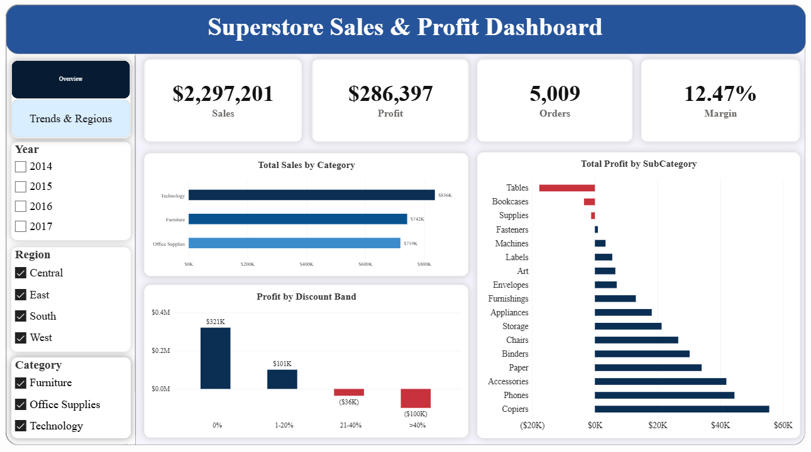
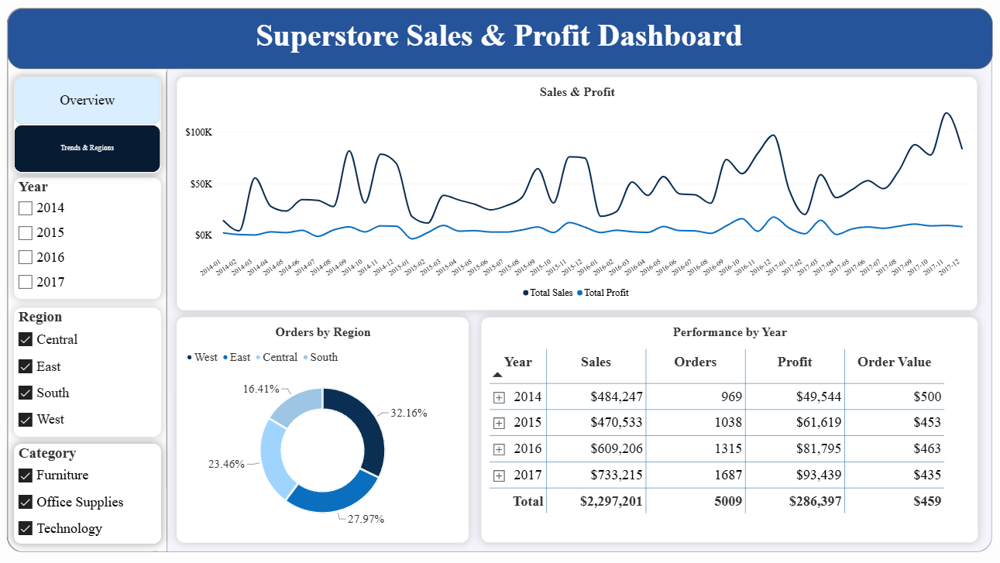
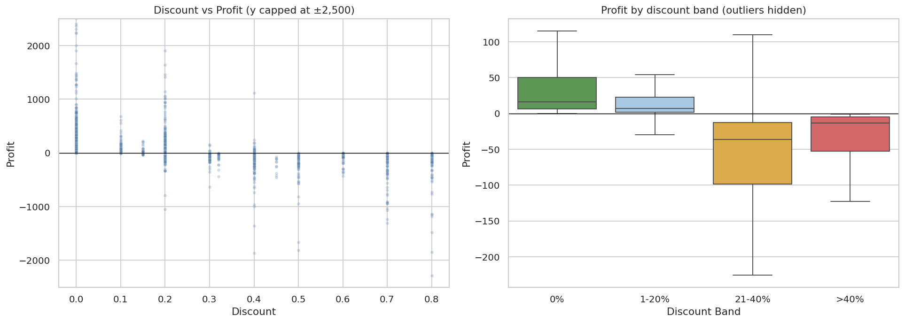
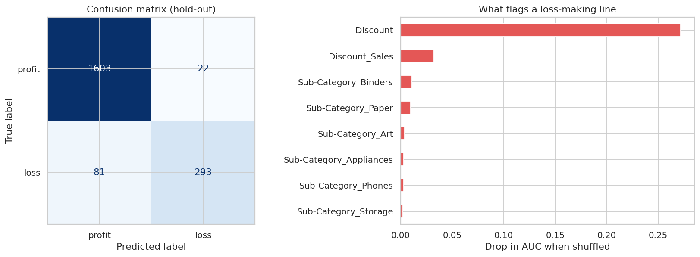

# Superstore Sales & Profit Analytics (SQL Server + Power BI + Excel + Python)

An end-to-end retail analytics project on one dataset: raw CSV is loaded into **SQL Server**, cleaned and aggregated with **T-SQL**, reported in a two-page **Power BI** dashboard (with an **Excel** backup), and analysed in depth with **Python** (outliers, predictive models).

### Power BI dashboard



## Business question

**Does growing revenue also grow profit, and which segments are quietly losing money?**
Dataset: Superstore, 9,994 order lines, 5,009 orders, 3 January 2014 to 30 December 2017.

## Tech stack

| Layer | Tools |
|---|---|
| Storage & processing | SQL Server, T-SQL, SSMS |
| Reporting | Power BI Desktop, DAX, Excel (PivotTable, PivotChart, Slicers) |
| Deep-dive analysis | Python, pandas, seaborn, scikit-learn, XGBoost |

## Workflow

```
superstore.csv ─► Superstore_raw ─► Sales ─► sales_summary_v ─┬─► Power BI (dashboard)
 (Kaggle)         (all nvarchar)   (typed,    (GROUP BY month/ └─► CSV ─► Excel (PivotTable)
                                    keyed,     region/category)
                                    indexed)

superstore.csv ─────────────────────────────────────────────────► Python notebooks (EDA, models)
```

1. **Load raw data.** CSV imported with the Import Flat File Wizard, every column `nvarchar` so a few dirty rows cannot fail the whole load.
2. **Clean and cast.** `Sales` table with proper types, primary key on `RowID` and two indexes. Dates are `M/D/YYYY`, converted with style 101 (verified: the middle part reaches 31, so it is the day).
3. **Explore and validate.** Row count, date range, NULLs, loss-making lines, business logic (no order ships before it is placed).
4. **Aggregate.** Six `GROUP BY` / `HAVING` / `CASE` queries and a reusable view `sales_summary_v`, reconciled to the base table.
5. **Excel backup.** The view is exported to CSV and analysed with PivotTables, PivotCharts and slicers.
6. **Power BI.** Direct connection to SQL Server (Import mode), a DAX `DimDate` table, measures and a 2-page dashboard with Year / Region / Category slicers.
7. **Python.** Outlier analysis, EDA and predictive modelling on the same CSV (see below).

## Dashboard contents

| Page | Visuals |
|---|---|
| Overview | KPI cards (Sales, Profit, Orders, Margin), Sales by Category, Profit by Discount Band, Profit by SubCategory (losses in red) |
| Trends & Regions | Monthly Sales & Profit (48 months), Orders by Region donut, Performance by Year table |

## Key DAX measures

```dax
Total Sales     = SUM ( Sales[Sales] )
Total Profit    = SUM ( Sales[Profit] )
Profit Margin   = DIVIDE ( [Total Profit], [Total Sales] )
Total Orders    = DISTINCTCOUNT ( Sales[OrderID] )
Sales LY        = CALCULATE ( [Total Sales], DATEADD ( DimDate[Date], -1, YEAR ) )
Sales YoY %     = DIVIDE ( [Total Sales] - [Sales LY], [Sales LY] )

Discount Band =
SWITCH (
    TRUE (),
    Sales[Discount] = 0,    "0%",
    Sales[Discount] <= 0.2, "1-20%",
    Sales[Discount] <= 0.4, "21-40%",
    ">40%"
)
```

`Total Orders` uses `DISTINCTCOUNT` on the `Sales` table, not a sum over the view, because an order can span several categories and would be double-counted.

## Headline numbers

| Metric | Value |
|---|---|
| Total sales | $2,297,201 |
| Total profit | $286,397 |
| Profit margin | 12.47% |
| Orders | 5,009 |

## Insights

**1. Discounts above 20% destroy profit.** 1,393 lines (14%) sit in the two loss-making bands, and 96.8% of all lines with a discount above 20% lose money.

| Discount band | Order lines | Sales | Profit | Margin | Lines with a loss |
|---|---|---|---|---|---|
| 0% | 4,798 | $1,087,908 | $320,988 | 29.5% | 0.0% |
| 1-20% | 3,803 | $846,522 | $100,785 | 11.9% | 13.8% |
| 21-40% | 460 | $234,138 | -$35,817 | -15.3% | 90.2% |
| >40% | 933 | $128,632 | -$99,559 | -77.4% | 100% |

**2. Three sub-categories lose money.** *Tables* (-$17,725 on $206,966 sales), *Bookcases* (-$3,473) and *Supplies* (-$1,189). Tables and Bookcases are discounted far more than average (26% and 21% vs 15%); Supplies loses money for another reason.

**3. Sales are strongly seasonal.** Q4 brings about 38% of revenue; September, November and December together about 43%. Sales dipped 2.8% in 2015, then grew 29.5% in 2016 and 20.4% in 2017 with margin steady around 13%.

**4. West leads, Central lags.** West: $725K sales, $108K profit (14.9% margin). Central has the lowest margin at about 7.9%. Texas (-$25.7K), Ohio (-$17.0K) and Pennsylvania (-$15.6K) lose the most.

**Recommendation:** cap discounts at about 20% (review Tables and Bookcases separately) and review pricing in the loss-making states.

## Python deep dive

Notebooks in [`notebooks/`](notebooks/), run on the same `superstore.csv`.

**[01 · EDA & outliers](notebooks/01_eda_outliers.ipynb)**
- 1,881 profit outliers by the IQR rule (18.8%): 604 large losses and 1,277 large profits. 81.6% of the large losses carry a discount above 20% (vs 13.9% of all lines); large profits have almost no discount (avg 5.5%) and are split between Office Supplies and Technology. Outliers are real transactions and are kept.



**[02 · Modelling](notebooks/02_profit_modeling.ipynb)** (5-fold cross-validation, no target leakage)

| Task | Best model | Result |
|---|---|---|
| Predict profit (regression) | XGBoost | R² 0.84 ± 0.07, MAE about $20 (linear models: R² 0.72, MAE about $41) |
| Flag loss-making lines (classification) | XGBoost | AUC 0.986, F1 0.85 |

- `Discount` is by far the strongest signal for losses. A one-line rule "discount > 20% means loss" reaches F1 0.83 vs 0.85 for the model, so a discount cap is the practical lever.
- **Data-leakage fix.** An earlier version of the Python work reported R² 0.79 with Lasso as best, but used `Profit Ratio` and `Profit_per_Unit` (both computed from `Profit`) as inputs. Removing them drops that setup to R² 0.42; adding sub-category and a tuned gradient-boosting model gives the 0.84 above. The notebook shows both numbers side by side.
- Profit is dominated by a few extreme lines (22 beyond ±$2,000), so R² varies a lot between folds; MAE is the steadier metric.



## Repository structure

```
├── README.md / README_vi.md
├── requirements.txt
├── data/
│   ├── superstore.csv            # raw data from Kaggle
│   └── sales_summary.csv         # export of sales_summary_v
├── sql/
│   ├── import_data.sql           # create DB, clean, build Sales table, validation checks
│   ├── sales_summary_view.sql    # 6 aggregate queries + sales_summary_v view
│   └── export_query.sql          # query used to export the CSV
├── notebooks/
│   ├── 01_eda_outliers.ipynb     # cleaning, IQR outliers, EDA
│   └── 02_profit_modeling.ipynb  # leakage check, regression, loss classifier
├── powerbi/Superstore_Dashboard.pbix
├── excel/superstore_report.xlsx
├── assets/                       # figures produced by the notebooks
└── screenshots/                  # Power BI dashboard screenshots
```

## How to reproduce

**SQL + Power BI**
1. Download `superstore.csv` from [Kaggle](https://www.kaggle.com/datasets/vivek468/superstore-dataset-final) (or use `data/superstore.csv`).
2. In SSMS create database `SuperstoreDB`, right-click it → **Tasks → Import Flat File**, load into table `Superstore_raw` (every column `nvarchar(255)`).
3. Run `sql/import_data.sql`, then `sql/sales_summary_view.sql`.
4. Open `powerbi/Superstore_Dashboard.pbix`, **Transform data → Data source settings**, point to your SQL Server and **Refresh**.

**Python**
```bash
pip install -r requirements.txt
cd notebooks
jupyter notebook          # open 01_eda_outliers.ipynb, then 02_profit_modeling.ipynb
```
The notebooks read `../data/superstore.csv`, so start Jupyter from inside `notebooks/`.

## Technical notes

- The import wizard renames columns with spaces or hyphens to use underscores (`Order Date` becomes `Order_Date`), so the cleaning script uses the underscore names. If yours differ, check `INFORMATION_SCHEMA.COLUMNS`.
- `ProfitMargin` in the view cannot be summed or averaged; in Power BI always use the `Profit Margin` measure.
- The SSMS Export Wizard needs Integration Services. On an expired Evaluation edition, use **Save Results As** to export CSV.
- If Power BI cannot connect with an encrypted connection to a local SQL Server, untick **Use Encrypted Connection**.

## Data source

[Superstore Dataset Final on Kaggle (vivek468)](https://www.kaggle.com/datasets/vivek468/superstore-dataset-final). Public data, used for learning purposes.

## Author

**Đào Việt Anh** · [@viet-anh-125](https://github.com/viet-anh-125)
